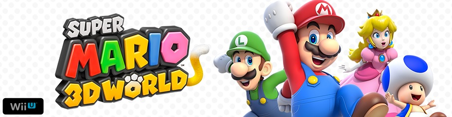
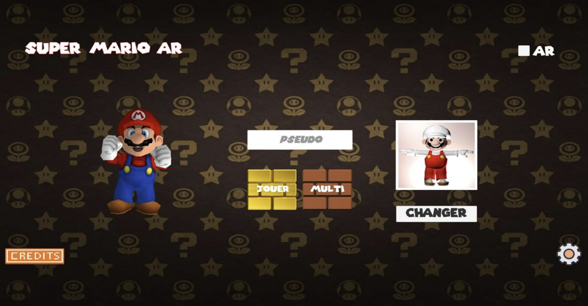
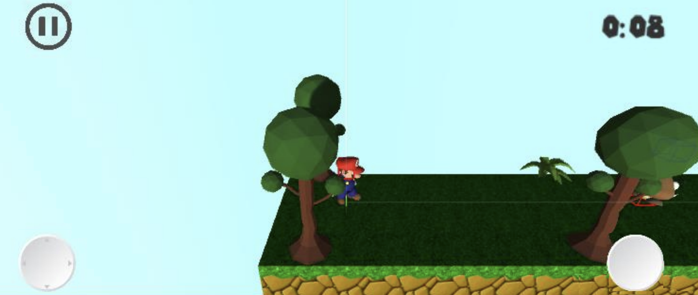

<h1 align="center">
  
</h1>

---

# MARIO REALITE AUGMENTEE

## Petit résumé

- La réalité augmentée est une technologie qui permet d'intégrer des éléments virtuels en 3D en temps réel au sein d'un environnement réel. Le principe est de combiner le virtuel et le réel et donner l'illusion d'une intégration parfaite à l'utilisateur.
- Super Mario est une série de jeux vidéo de plates-formes créée par Nintendo et mettant en scène sa mascotte Mario. Au moins un jeu Super Mario est sorti sur chaque console majeure de Nintendo depuis le premier épisode, Super Mario Bros.
- Cependant aucun jeux Mario n'est encore disponible en réalité augmentée et nous avons décidez de rémedier à sa !

## Objectifs

- Réaliser des maps Super Mario.
- L'intégrer en réalité augmentée.
- Intégrer du multi-joueur.

## Techno

- C#
- Unity
- Blender

## MENU PRINCIPALE

## IN GAME

## Auteur

- [@Cokil](https://github.com/super-cokil)
- [@Pierre](https://github.com/Pierre-Portfolio)